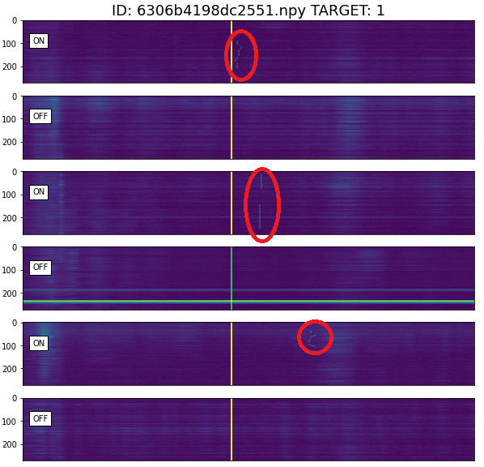

# Projektarbeit: SETI Breakthrough Listen

Dieses Repository enthält eine Lösung für die kaggle Challenge [SETI Breakthough Listen - E.T. Signal Search](https://www.kaggle.com/c/seti-breakthrough-listen/overview). Das in diesem Projekt enthaltene Notebook ist im Rahmen einer Projektarbeit an der Hochschule Karlsruhe entstanden.

## Inhaltsverzeichnis
- [Projektarbeit: SETI Breaktrhough Listen](#projektarbeit-seti-breakthrough-listen)
	- [Die Challenge](#die-challenge)
	- [Projektstruktur](#projektstruktur)
	- [Vewendung des CNNs](#verwenung-des-cnns)
	- [Evaluation der Performance des CNNs](#evalation-der-performance-des-cnns)

## Die Challenge
Die Aufgabe bei der Challenge [SETI Breakthough Listen - E.T. Signal Search](https://www.kaggle.com/c/seti-breakthrough-listen/overview) besteht darin, aus einem Heuhaufen von Kadenzen solche zu finden, die ein künstlich hinzugefügtes Signal enthalten. Ein Beispiel für ein solches Signal ist auf dem folgenden Bild zu erkennen:

Auf den "ON" Spektrogrammen, also solchen, bei denen das Teleskop auf das zu untersuchende Ziel gerichtet war, ist jeweils ein Signal zu erkennen, dass auf den "OFF" Spektrogrammen nicht zu finden ist. Es handelt sich also um eine der gesuchten Kadenzen. Das Signal, das auf allen sechs Bildern senkrecht verläuft, ist hingegen keines der gesuchten Signale, sondern ein irdisches Störsignal.

Um die gesuchten Signale in den Kadenzen zu finden, haben wir ein Convolutional Neural Netowork (CNN) auf Grundlage des EfficientNet-b5 trainiert.

## Projektstruktur
Diese Projekt enthält zwei Dateien, in denen einigen Ansätze mit klassischer Computer Vision probiert worden sind, um die Signale besser sichtbar zu machen. Dabei wurde insbesondere versucht das Rauschen mithilfe von Filtern und Algorithmen zu mindern. Die wesentliche Datei ist das Notbeook SchnaufNet2.0, welches die Algorithmen enthält, die zum Trainieren des CNNs benötigt werden.

Das SchnaufNet2.0 nutzt dabei eine vortrainierte Version des EfficientNets-b5. Hyperparameter, wie etwa die Anzahl der Folds und Epochen, die für das Training verwendet werden sollen, können dabei über ein Konfigurations-Dictionary festgelegt werden:

	conf_dict = {
    	"epochs": 10,
    	"folds": 5,
		"batch_size": 8,
    	"learn_rate": 1e-3,
		...
	}

## Verwendung des CNNs
Um das Training des CNNs auszuführen, werden neben dem Notebook SchnaufNet2.0 auch die Trainingsdaten der Challenge benötigt, welche unter Tab [Data](https://www.kaggle.com/c/seti-breakthrough-listen/data) der kaggle Challenge zu finden sind.

## Evalation der Performance des CNNs
Zum Zeitpunkt der Projektarbeit war die Challenge nicht mehr aktiv, sodass kein finaler Score auf Basis der Testdaten aus der Challenge ermittelt werden kann. Die Testdaten sind zwar noch verfügbar, jedoch gibt es zu diesen keine Labels. Das Notebook verwendet als Validierungsdaten einen Teil der Trainingsdaten, um einen Score zu ermitteln.